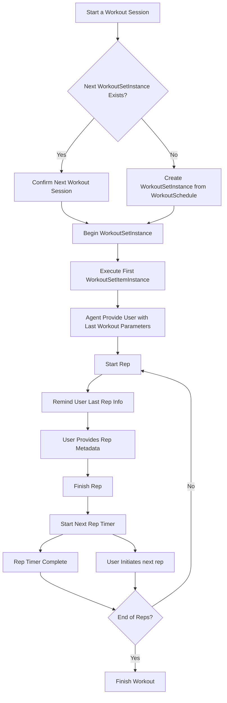
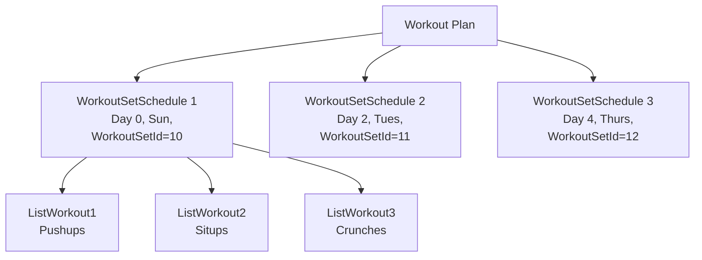
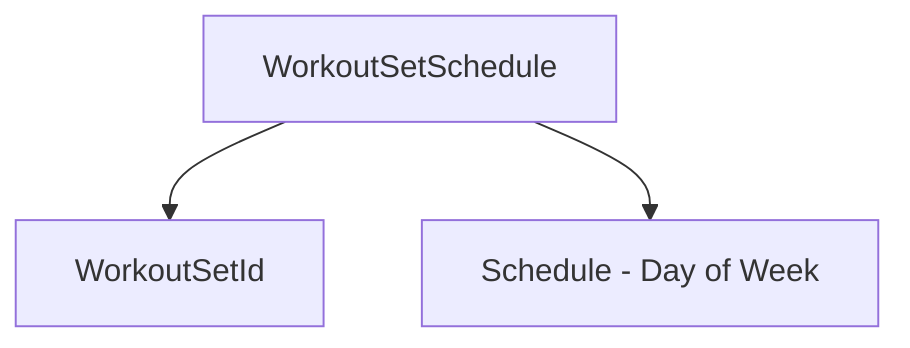
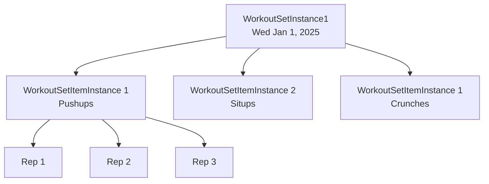

# Running the app
Spin up local database

```terminal
docker run -d --name postgres_local_fitgpt -e POSTGRES_USER=fitgpt -e POSTGRES_PASSWORD=fitgpt -e POSTGRES_DB=fitgpt -v C:\Users\wenli\OneDrive\Apps\fitgpt\db:/var/lib/postgresql/data -p 5432:5432 postgres:latest
```
Replace C:\Users... with your own local file path

Download DBeaver and confirm connection to local database 

Server
```terminal
cd server && npm install
npm run prisma:push
npx run prisma:seed
npm start
```

Client
```terminal
cd client && npm install
npm start
```

# Agent workflows




## Start a Workout Session
Start a workout session. The agent should tell you which is the next workout session on the schedule, and ask the user to confirm.

If the next workoutSetInstance does not exist, it should create one from the WorkoutSchedule model. To check if the workoutSetInstance exists, we can query WorkoutSetSchedule, and see if a workoutSetInstanceId exists.

Once the workout begins, we should be on a WorkoutSetInstance, and the agent will ask you to execute the first workoutSetItemInstance (workout), starting with the first rep. The agent will tell you the parameters of the last time you did this workout, including how many days ago, the weight, reps, and any relevant info, and encourage you to beat your own record and push harder.

## What can I do?
### If you have not started a workout session
Agent will remind you your next workout session, and prompt to see if you want to start it

### You've already started a workout session.
The agent should remind you what WorkoutSetInstance you're working on (Abs), and what specific workout you're doing (Crunches). 

If you're on your current rep, it'll tell you what rep you're on, and how many reps you did last time.  If you just finished a rep, it'll tell you what rep to start on, and how many you did last time.

If you're in the middle of a rep, the agent will remind you to tell it how many reps you did, how much weight, and any other relevant metadata.

## Give the current rep info
"Hey I did 10 reps this time, and I pushed to exhaustion"

Agent will record 10 reps on this current work out, and "add exhaustion" to the notes
and confirm this back to the user.

The agent will ask if you want to finish this rep and move to the next one. If you say yes, it'll remind you that you should rest for 30 seconds and begin a countdown timer for when to start the next rep. The user can change this preference on the fly by asking the agent to update the rep interval to 90 seconds.

## Starting my next rep
"Start the next rep". User can use this command to start the next rep.

If the user asked the agent to the finish the rep, it will automatically start the next rep after the rep timer expires. It'll tell the user "Please start your next rep", and tell you about the rep metadata.

## Finish workout
"I'm done working out"

Agent will close out the workoutSetInstance, and confirm.

# Data Model
## Planning
Planning solves the follow type of thought flow, with related data models:
* I want to workout 3 days a week (workoutPlan).
* For Day 1 (WorkoutPlanSchedule), I want to do "abs and shoulder" (WorkoutSet)
* For "Abs and Shoulder" (WorkoutSet), I want to do Crunches, Leg Lifts, Planks, Lat Pulls, Seated Rows (WorkoutSetItems)

### Workout Plan
A user defines a Workout Plan, which is a collection of Workout Sets. Each Workout Set contains a set of ListWorkouts (e.g. Pushup, Situp).  A workoutSet is a group of individual workouts to be performed in a single session.




### Workout Set Schedule
The workout set schedule relates a WorkoutSet to a WorkoutPlan, and defines a schedule (e.g WorkoutSet = Legs, Biceps, Abs, do this on Tuesdays)



### ListWorkout
A listWorkout contains a configuration list of individual workouts. It can contain metadata such as hasWeight, hasTime, hasDistance which specify what type of metadata is to be stored on the actual execution of the Reps (See Execution -> Reps)


## Execution 
### WorkoutSetInstance

Excusion phase of workouts. The Workout plan gets converted into a set of actual workoutSets, called WorkoutSetInstances with target dates.

Each WorkoutSetInstance contains a collection of WorkoutSetItemInstances



### Rep 
Contains the data from each executed rep of a listWorkoutItem, along with metadata such as:

| Metadata      | Description                                      |
|---------------|--------------------------------------------------|
| repNumber     | The number of the rep in the sequence            |
| count         | The number of repetitions                        |
| weight        | The weight used during the rep                   |
| weightUnit    | The unit of the weight (e.g., kg, lbs)           |
| distance      | The distance covered during the rep              |
| distanceUnit  | The unit of the distance (e.g., meters, miles)   |
| time          | The time taken to complete the rep               |
| timeUnit      | The unit of the time (e.g., seconds, minutes)    |
