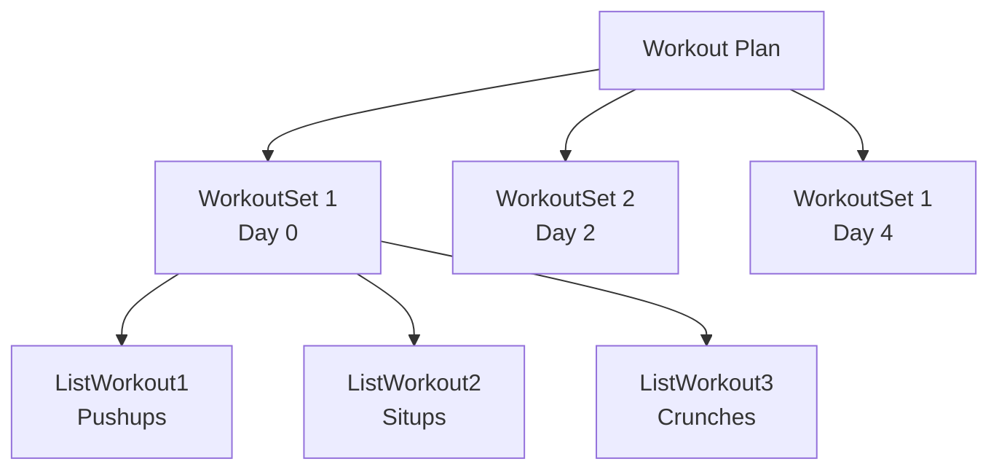
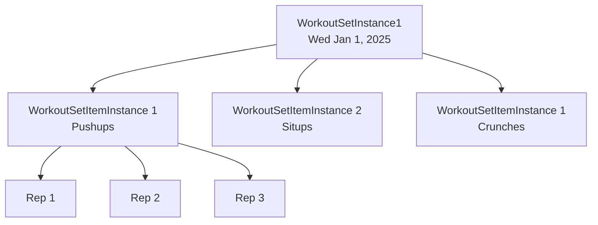

# Planning
## Workout Plan
A user defines a Workout Plan, which is a set of Workout Sets. Each Workout Set contains a set of ListWorkouts (e.g. Pushup, Situp).  A workoutSet is a group of individual workouts to be performed in a single session.

## ListWorkout
A listWorkout contains a configuration list of individual workouts. It can contain metadata such as hasWeight, hasTime, hasDistance which specify what type of metadata is to be stored on the actual execution of the Reps (See Execution -> Reps)

# Execution 
## WorkoutSetInstance

Excusion phase of workouts. The Workout plan gets converted into a set of actual workoutSets, called WorkoutSetInstances with target dates.

Each WorkoutSetInstance contains a collection of WorkoutSetItemInstances

## Rep 
Contains the data from each executed rep of a listWorkoutItem, along with metadata such as:

| Metadata      | Description                                      |
|---------------|--------------------------------------------------|
| repNumber     | The number of the rep in the sequence            |
| count         | The number of repetitions                        |
| weight        | The weight used during the rep                   |
| weightUnit    | The unit of the weight (e.g., kg, lbs)           |
| distance      | The distance covered during the rep              |
| distanceUnit  | The unit of the distance (e.g., meters, miles)   |
| time          | The time taken to complete the rep               |
| timeUnit      | The unit of the time (e.g., seconds, minutes)    |

# Workflows
## Design
1. User designs a Workout Plan, by creating WorkoutSets with ListWorkout items
1. User chooses a Workout Plan, and generates the workouts based on a Start Date and # of repeats
   
## Execute 
User performs workouts based on WorkoutSetInstances